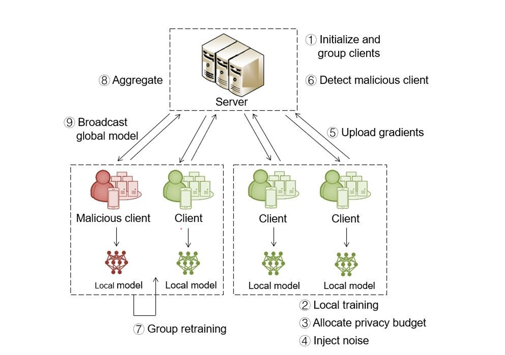

# Untrusted Federated Learning

This project implements and evaluates privacy protection methods for federated learning in untrusted environments, including both active defense and passive protection mechanisms.

## Project Overview

Federated learning is a distributed machine learning paradigm that allows multiple clients to collaboratively train models while keeping their local data private. However, federated learning is vulnerable to various attacks in the presence of malicious participants, especially Byzantine attacks where malicious clients may send manipulated gradients to disrupt model training.

This project focuses on:
1. Implementation and analysis of various Byzantine attack methods
2. Defense mechanisms against Byzantine attacks
3. Application of privacy protection techniques in federated learning

## System Architecture



The system architecture consists of the following components and workflow:

1. **Initialize and group clients**: Server initializes the system and organizes clients into groups
2. **Local training**: Each client trains models on their local data
3. **Allocate privacy budget**: Privacy parameters are determined for each client
4. **Inject noise**: Noise is added to model updates for privacy protection
5. **Upload gradients**: Clients send protected model updates to the server
6. **Detect malicious client**: Server identifies potentially malicious clients
7. **Group retraining**: Affected client groups retrain their models
8. **Aggregate**: Server aggregates all valid model updates
9. **Broadcast global model**: Updated global model is distributed to all clients

## Project Structure

```
untrusted_federated_learning/
├── config/                      # Configuration files directory
│   └── default_config.py        # Default configuration settings
├── data/                        # Data storage directory
├── results/                     # Experiment results directory
├── src/                         # Source code directory
│   ├── attacks/                 # Byzantine attack implementations
│   │   └── byzantine.py         # Various Byzantine attack methods
│   ├── datasets/                # Dataset processing
│   │   ├── mnist_data.py        # MNIST dataset loading and processing
│   │   └── cifar10_data.py      # CIFAR-10 dataset loading and processing
│   ├── defenses/                # Defense mechanism implementations
│   │   └── aggregation.py       # Aggregation defense algorithms
│   ├── experiments/             # Experiment scripts
│   │   ├── mnist_experiment.py  # MNIST experiments
│   │   └── cifar10_experiment.py # CIFAR-10 experiments
│   ├── federated/               # Federated learning core implementation
│   │   ├── client.py            # Client implementation
│   │   └── server.py            # Server implementation
│   ├── models/                  # Model definitions
│   │   ├── mnist_models.py      # MNIST models
│   │   └── cifar10_models.py    # CIFAR-10 models
│   ├── utils/                   # Utility tools
│   │   └── visualization.py     # Visualization tools
│   └── __init__.py              # Initialization file
├── main.py                      # Main entry script
├── run_experiment.py            # Experiment runner script
└── README.md                    # Project documentation
```

## Features

- Federated learning implementation for MNIST and CIFAR-10 datasets
- Multiple Byzantine attack method implementations:
  - Partial Trim Attack
  - Full Trim Attack
  - Mean Attack
  - Gaussian Attack
  - Label Flip Attack
  - Backdoor Attack
- Multiple defense mechanism implementations:
  - Simple Mean Aggregation
  - Trimmed Mean Aggregation
  - Median Aggregation
  - Krum Aggregation
- Privacy protection methods:
  - Differential Privacy

## Requirements

### System Requirements
- Python 3.7+
- CUDA-supported GPU (recommended but not required)

### Dependencies
```
mxnet-cu102>=1.7.0  # For CUDA 10.2, select appropriate MXNet version for other CUDA versions
numpy>=1.19.2
matplotlib>=3.3.2
```

## Installation Guide

1. Clone the repository (if from GitHub) or extract the downloaded project files

2. Create and activate a virtual environment (optional but recommended):

```powershell
# Create virtual environment using venv
python -m venv venv
# Activate virtual environment
.\venv\Scripts\Activate
```

3. Install required dependencies:

```powershell
# Install basic dependencies
pip install numpy matplotlib

# Install MXNet (GPU version, if CUDA support is available)
pip install mxnet-cu102  # For CUDA 10.2 version

# Or install CPU version
# pip install mxnet
```

## Usage Guide

### Running Individual Experiments

Use the `main.py` script to run individual experiments:

```powershell
# Run MNIST dataset experiment with CNN model and simple mean aggregation
python main.py --dataset mnist --model cnn --aggregation simple_mean

# Run CIFAR-10 dataset experiment with 30 Byzantine workers, using mean attack and median defense
python main.py --dataset cifar10 --nbyz 30 --byz_type mean_attack --aggregation median

# Enable privacy protection for an experiment
python main.py --dataset mnist --protected
```

### Running Comparison Experiments

Use the `run_experiment.py` script to run experiments comparing different methods:

```powershell
# Compare different defense mechanisms on MNIST dataset
python run_experiment.py --dataset mnist --experiment defense --nepochs 50

# Compare different attack methods on CIFAR-10 dataset
python run_experiment.py --dataset cifar10 --experiment attack --nepochs 50

# Compare performance with and without privacy protection
python run_experiment.py --dataset mnist --experiment protection --nepochs 50
```

### Viewing Experiment Results

Experiment results are saved in the `results/` directory, including:

- Test accuracy curves over training epochs
- Performance comparison charts for different methods
- Evaluation results for specific attacks (such as backdoor attacks)

## Parameter Description

### main.py Parameters

| Parameter | Description | Default Value |
|------|------|--------|
| --dataset | Dataset selection (mnist or cifar10) | mnist |
| --model | Model type (mlr, cnn, fcnn) | cnn |
| --batch_size | Batch size | 32 |
| --lr | Learning rate | 0.00005 |
| --nworkers | Number of worker nodes | 100 |
| --nepochs | Number of training epochs | 500 |
| --gpu | GPU ID (-1 indicates using CPU) | 0 |
| --nbyz | Number of Byzantine nodes | 0 |
| --byz_type | Attack type | no |
| --aggregation | Aggregation rule | simple_mean |
| --protected | Enable privacy protection | False |
| --bias | Degree of Non-IID data distribution | 0.1 |

### run_experiment.py Parameters

| Parameter | Description | Default Value |
|------|------|--------|
| --dataset | Dataset selection (mnist or cifar10) | mnist |
| --experiment | Experiment type (defense, attack, protection) | defense |
| --nepochs | Number of training epochs | 100 |
| --gpu | GPU ID | 0 |

## Example

Below is a complete experiment example showing how to run a series of experiments and compare results:

```powershell
# Clean previous results (if needed)
Remove-Item -Path ".\results\*" -Recurse -Force

# Run defense mechanism comparison experiment
python run_experiment.py --dataset mnist --experiment defense --nepochs 30

# Run attack method comparison experiment
python run_experiment.py --dataset mnist --experiment attack --nepochs 30

# Run privacy protection comparison experiment
python run_experiment.py --dataset mnist --experiment protection --nepochs 30

# View results
explorer.exe .\results\
```

## Troubleshooting

Common issues:

1. **Out of Memory Error**:
   - Reduce the `batch_size` parameter
   - Reduce the number of worker nodes (`nworkers`)

2. **GPU Out of Memory**:
   - Switch to CPU mode (`--gpu -1`)
   - Use a smaller model (`--model mlr`)

3. **Import Errors**:
   - Ensure all dependencies are correctly installed
   - Make sure to run scripts from the project root directory